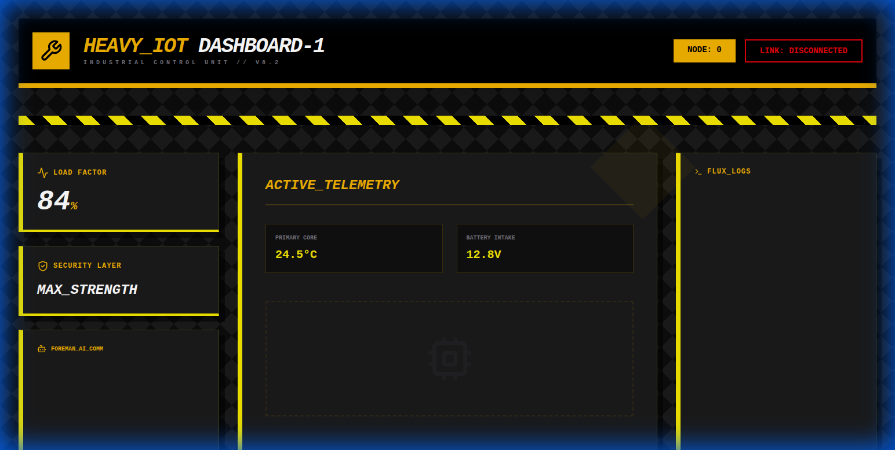
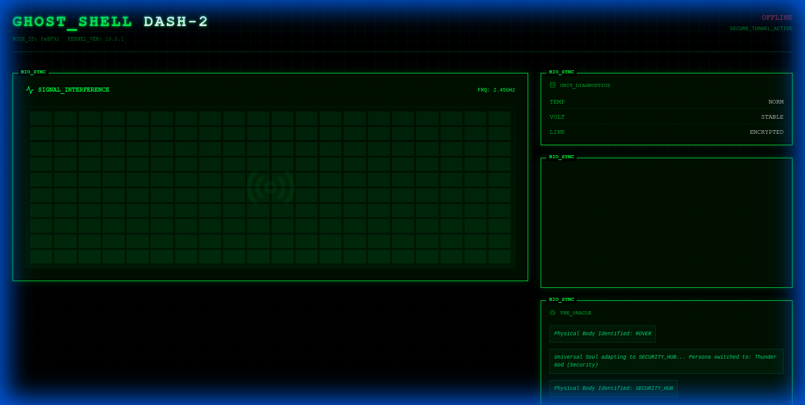
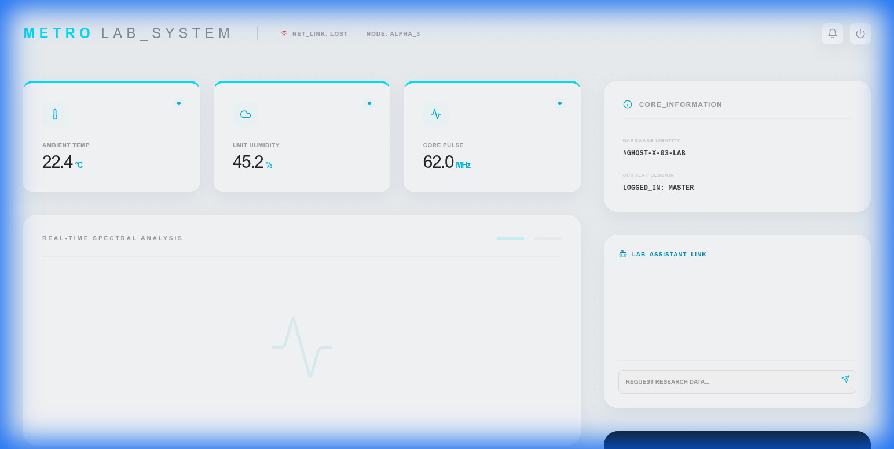
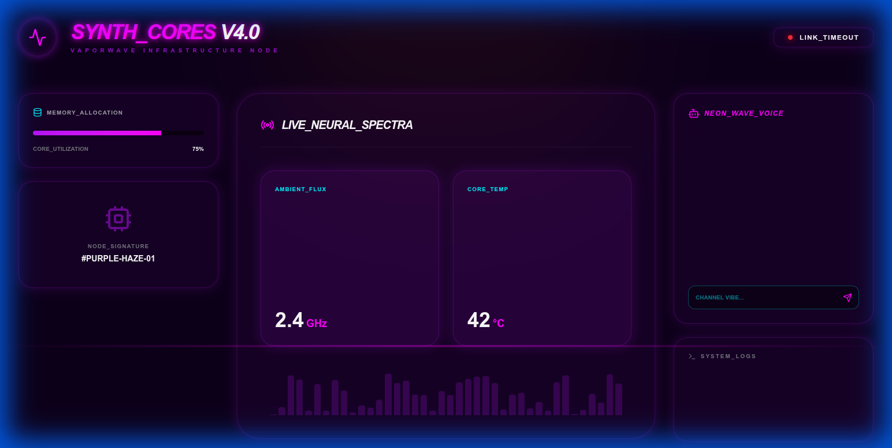
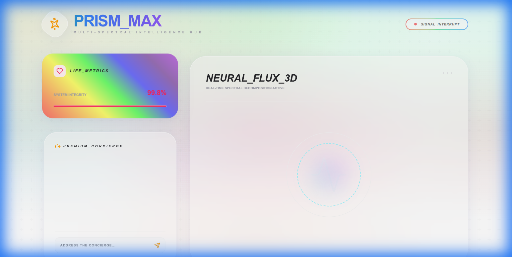
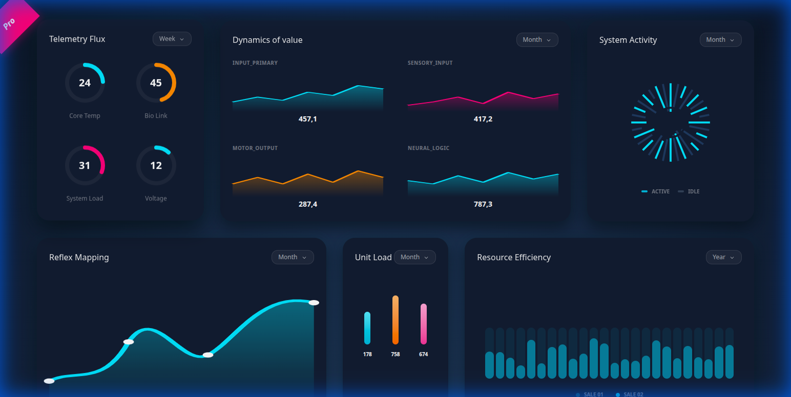
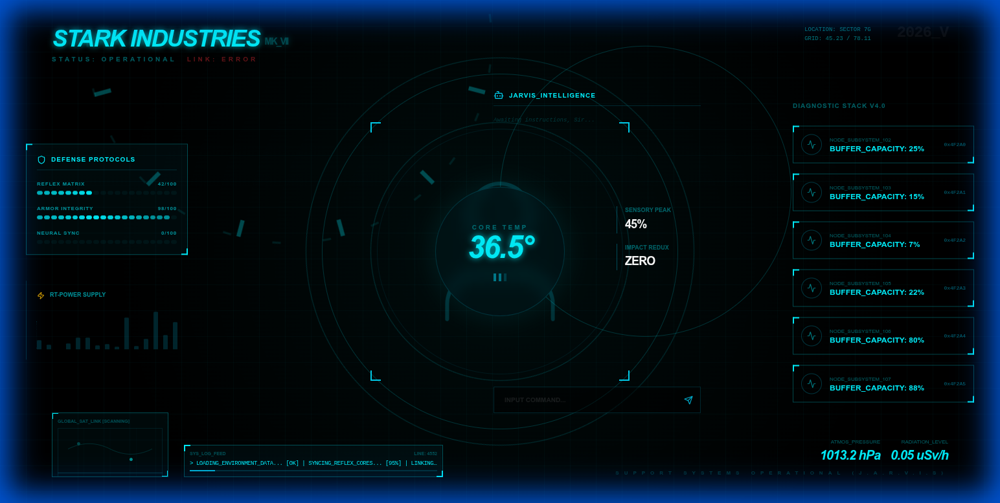
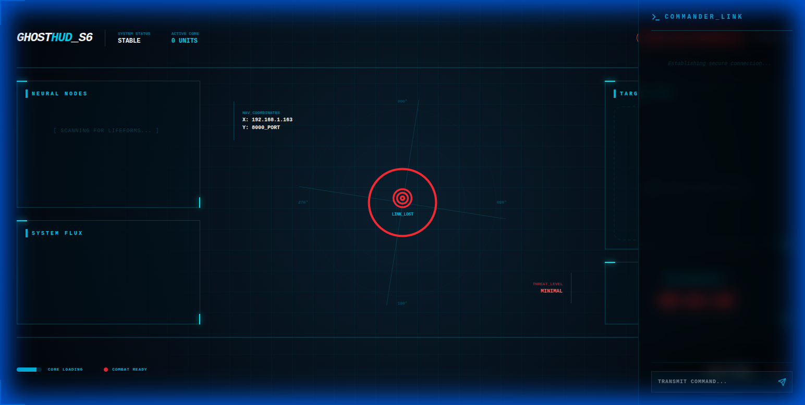

# 🌐 Micro IoT Dashboard Hub (Central Command)

**ศูนย์บัญชาการกลางสำหรับการควบบคุบและบริหารจัดการหุ่นยนต์และอุปกรณ์ IoT ในระบบ GhostMicro**

A premium, futuristic dashboard hub for managing multiple IoT nodes, rescue robots, and UAVs. Built with **Next.js 16 (App Router)**, **Tailwind CSS 4**, and **Socket.io** for real-time synchronization with the Genesis Neural Core.

---

## 📖 1. บทนำ (Introduction)

**Micro IoT Dashboard Hub** คือ "ศูนย์บัญชาการกลาง" (Central Command) ของระบบ Microtronic/GhostMicro ที่ทำหน้าที่รวบรวมทางเข้าสู่ Dashboard ย่อย ทั้ง 8 ตัว และเครื่องมือบริหารจัดการ AI (Neuro Lab) ไว้ในที่เดียว

ออกแบบมาในธีม **Cyberpunk Glassmorphism** ที่เน้นความล้ำสมัย สวยงาม และดุดัน มอบประสบการณ์การควบคุมในระดับ Enterprise-grade สำหรับงานด้านกู้ภัย (Rescue), เกษตรอัจฉริยะ (Smart Farm) และระบบอัตโนมัติภายในบ้าน (Smart Home)

---

## 🖼️ Dashboard Themes & Previews

Hub รองรับธีมที่แตกต่างกันสำหรับ Node แต่ละตัว เพื่อให้ง่ายต่อการแยกแยะการทำงาน:

|                                                                      |                                                                  |                                                                  |
| :------------------------------------------------------------------: | :--------------------------------------------------------------: | :--------------------------------------------------------------: |
|  <br>Tactical HUD  | <br>Industrial | <br>Matrix Bio |
|  <br>Minimal Lab   | <br>Synthwave  | <br>Prismatic  |
| <br>Efficiency Pro | <br>Stark HUD  |                                                                  |

---

## ⚙️ 2. ระบบการทำงาน (System Architecture)

Hub ทำหน้าที่เป็น **Front-end Portal** ที่เชื่อมต่อกับบริการต่างๆ ดังนี้:

### A. การเชื่อมต่อหลัก (Core Connections)
- **Genesis AI Core (The Brain)** 🧠: เชื่อมต่อผ่าน Port 8000 เพื่อดึงสถานะระบบ, รายชื่อ AI Personas, และจัดการชุดความทรงจำ (Memories)
- **THAP Firmware Integration** 🚁: รองรับการแสดงผลข้อมูลจาก Autopilot Firmware สำหรับเครื่องบินและหุ่นยนต์กู้ภัย
- **Dashboard Satellites (1-8)** 🛰️: ลิงก์ไปยังหน้าควบคุมเฉพาะทางของหุ่นยนต์แต่ละตัวที่ Deploy ไว้บน Vercel

### B. โครงสร้างภายใน (Internal Structure)
- **Neuro Lab (`/neuro-lab`)**: แผงควบคุมลับสำหรับปรับแต่ง "ตัวตน" และ "จิตวิญญาณ" ของ AI (Persona & Instructions)
- **Real-time Sync**: ใช้ Socket.io ในการอัปเดตสถานะแบบทันที (Low Latency)

---

## 🚀 3. เริ่มต้นใช้งาน (Quick Start)

1. **ติดตั้ง Dependencies:**
   ```bash
   npm install
   ```

2. **เปิดการใช้งาน (Development Mode):**
   ```bash
   # ตรวจสอบให้แน่ใจว่าได้รัน Genesis Core ไว้ก่อน
   npm run dev
   ```

3. **Active Hub:**
   Open [https://micro-iot-dashboard-hub.vercel.app/](https://micro-iot-dashboard-hub.vercel.app/)

---

## 🛠️ 4. ฟีเจอร์สำคัญ (Core Features)

- **8 Multi-Themes Integration**: สถาปัตยกรรมที่รองรับธีมที่หลากหลาย (Cyberpunk, Matrix, Stark, ฯลฯ)
- **Centralized Command**: รวมทุกการเชื่อมต่อของ GhostMicro ไว้ที่จุดเดียว
- **Neuro Lab Advanced Config**: ปรับแต่ง AI Persona ได้อย่างละเอียดผ่าน UI
- **Futuristic Glassmorphism**: ดีไซน์ระดับ Premium ที่มาพร้อมกับ Fluid Animations และ Ultra-Responsive UI

---

## 📡 5. รายชื่อ Node ที่เชื่อมต่อ (Live Satellites)

- Node 1: [Tactical HUD (Search & Rescue)](https://micro-iot-dashboard-1.vercel.app/)
- Node 2: [Industrial (Automation Control)](https://micro-iot-dashboard-2.vercel.app/)
- Node 3: [Matrix Bio (Smart Farm Monitoring)](https://micro-iot-dashboard-3.vercel.app/)
- Node 4: [Minimal Lab (Research & Data)](https://micro-iot-dashboard-4.vercel.app/)
- Node 5: [Synthwave (Entertainment & UX)](https://micro-iot-dashboard-5.vercel.app/)
- Node 6: [Prismatic (Network Visualization)](https://micro-iot-dashboard-6.vercel.app/)
- Node 7: [Efficiency Pro (Performance Lab)](https://micro-iot-dashboard-7.vercel.app/)
- Node 8: [Stark HUD (Master Command)](https://micro-iot-dashboard-8.vercel.app/)

---

> **Development Note**: Hub ตัวนี้เป็นส่วนหนึ่งของระบบนิเวศ **Microtronic.dev** โดยมุ่งเน้นการใช้งานเทคโนโลยี Next.js 16 และ Tailwind CSS 4 เพื่อประสิทธิภาพสูงสุด
